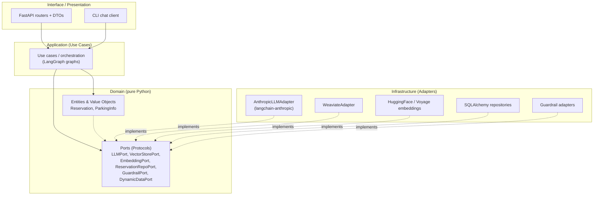
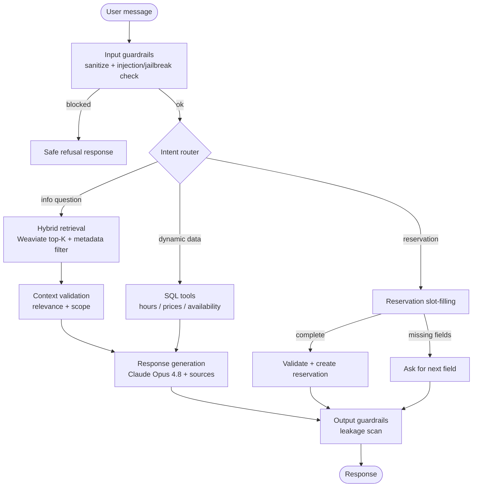
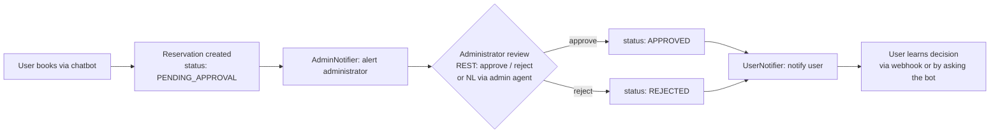
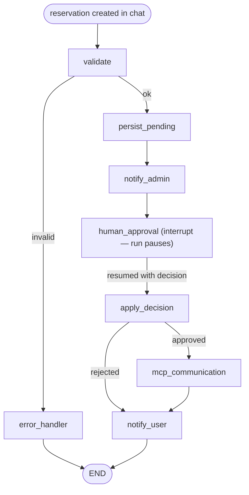

# AutoParkGPT — Architecture

> Status: **Proposed (Phase 1)**. Awaiting approval before Stage 1 implementation.
> This document is generated and maintained by Claude per `CLAUDE.md`.

---

## 1. Purpose & Scope

AutoParkGPT is a production-grade, RAG-based parking-reservation chatbot. It answers
parking questions (info, hours, prices, availability, location) and interactively
collects reservation requests. Later stages add a human-in-the-loop administrator
approval agent, an MCP server for persisting approved reservations, and a unified
LangGraph orchestration across all components.

The system is built around four staged deliverables (see `TASKS.md`), but the
architecture below is designed up front so each stage slots into a stable skeleton
rather than being retrofitted.

---

## 2. Requirements Analysis

### 2.1 What the spec asks for (distilled)

| Capability | Source | Stage |
|---|---|---|
| RAG over static parking info | "Static Data → vector DB" | 1 |
| Dynamic data (hours, prices, availability) in SQL | "Dynamic Data → SQL" | 1 |
| Interactive reservation slot-filling (name, surname, car number, period) | "General Features" | 1 |
| Guardrails (prompt injection, jailbreak, info leakage, input validation) | "Security Requirements" | 1 |
| Retrieval + performance evaluation (Recall@K, Precision@K, latency, throughput) | "Evaluation Requirements" | 1 |
| Human-in-the-loop admin approval (2nd agent) | Stage 2 | 2 |
| MCP server writing approved reservations to file | Stage 3 | 3 |
| LangGraph orchestration unifying all components | Stage 4 | 4 |
| Docker Compose, CI/CD (GitHub Actions), tests (≥2/module), docs | cross-cutting | all |

### 2.2 Ambiguities identified & resolutions

Per `CLAUDE.md` / the spec, I resolve non-blocking ambiguities with documented
engineering decisions rather than blocking on questions.

1. **Embeddings provider is unspecified — and Anthropic has no embeddings API.**
   The spec mandates LangChain + a vector DB but never names an embedding model, and
   the LLM provider (Claude) does **not** expose an embeddings endpoint. This is the
   single most consequential gap.
   **Resolution:** Treat embeddings as a pluggable port. Default to a **local
   HuggingFace model** (`BAAI/bge-small-en-v1.5`, 384-dim) so local dev and the
   evaluation harness are fully offline, deterministic, and free of an extra API key.
   Provide a **Voyage AI** adapter (`voyage-3`) as the documented production option
   (Voyage is Anthropic's recommended embeddings partner). Swappable via config.

2. **Vector DB choice (Milvus | Pinecone | Weaviate).**
   Pinecone is cloud-only (no local Docker, requires a key) — it conflicts with
   "easy to run locally" and "no hardcoded secrets" for the dev path. Milvus is highly
   scalable but heavy (requires etcd + MinIO + the Milvus node — 3+ containers). Weaviate
   runs as a **single container**, supports **hybrid search (BM25 + dense)**, native
   metadata filtering, and has a mature LangChain integration.
   **Resolution:** **Weaviate** for Stage 1, behind a `VectorStorePort` so Milvus or
   Pinecone can be swapped in for production scale without touching application logic.

3. **SQL database (SQLite | PostgreSQL).**
   **Resolution:** **PostgreSQL** via Docker Compose for the running system; **SQLite**
   for unit tests and zero-dependency local runs. Both reached only through SQLAlchemy +
   Alembic, so the choice is a connection-string detail, not an architectural one.

4. **LLM model is unspecified.**
   **Resolution:** **Claude Opus 4.8** (`claude-opus-4-8`) via LangChain `ChatAnthropic`,
   with adaptive thinking and `effort` configurable. Model ID is config-driven; the
   `LLMPort` abstracts the SDK so the model/provider is swappable. (Opus 4.8 is the
   current most-capable Opus-tier model; 1M context, adaptive thinking only — no
   `budget_tokens`.)

5. **"Availability" — static or dynamic?**
   Listed under dynamic data. **Resolution:** model parking *capacity/location/general
   rules* as static (vector DB) and *live free-spaces, hours, prices* as dynamic (SQL),
   queried via tools the agent calls — not retrieved from the vector store.

6. **Conversation state persistence.**
   The spec implies multi-turn slot-filling but doesn't specify session storage.
   **Resolution:** LangGraph checkpointer. In-memory for Stage 1 tests; Postgres-backed
   checkpointer for the running app (so a reservation in progress survives restarts).

7. **Reservation field formats (car number, period).**
   Unspecified. **Resolution:** validate via Pydantic — car number against a configurable
   regex (default: alphanumeric plate pattern), reservation period as a start/end datetime
   with `end > start`, both in the future, max duration configurable. Documented as
   assumptions; easy to tighten per a real client's locale.

### 2.3 Recommended improvements over a naive reading

- **Hybrid retrieval** (dense + BM25) instead of pure vector search — materially better
  Recall@K on short factual parking queries; Weaviate supports it natively.
- **Tool-calling for dynamic data** rather than stuffing live prices/hours into the
  prompt — keeps answers fresh and auditable, and is the correct seam for Stage 4.
- **Guardrails as a pipeline of small, independently-testable validators** rather than
  one monolith — input sanitation → injection/jailbreak detection → retrieval scope
  enforcement → output leakage scan.
- **Source attribution** carried through retrieval into responses (satisfies the RAG
  "source attribution" requirement and aids eval).

---

## 3. Architectural Style

**Clean Architecture** with strict dependency inversion. Dependencies point **inward**;
the domain knows nothing about LangChain, Weaviate, FastAPI, or Anthropic.



### 3.1 Layer responsibilities

- **Domain** — Pydantic entities/value objects, domain exceptions, and **ports** defined
  as `typing.Protocol`. No framework imports. Fully unit-testable in isolation.
- **Application** — Use cases that orchestrate ports. RAG and reservation flows are
  expressed as **LangGraph** graphs whose nodes call domain ports. No concrete adapters.
- **Infrastructure** — Concrete adapters implementing the ports (Weaviate, Anthropic via
  LangChain, SQLAlchemy, embedding models, guardrails). All external I/O lives here.
- **Interface** — FastAPI app (REST), a CLI client, request/response DTOs separate from
  domain entities. Thin; delegates to use cases.
- **Composition root** — wires adapters to ports via dependency injection
  (`dependency-injector`), driven entirely by environment config (`pydantic-settings`).

---

## 4. Proposed Project Structure

```
autoparkgpt/
├── pyproject.toml                # uv/poetry, ruff, mypy, pytest config
├── docker-compose.yml            # app + weaviate + postgres
├── Dockerfile
├── .env.example                  # documented env vars, NO secrets
├── alembic/                      # SQL migrations
├── data/
│   └── static/                   # source docs for vector ingestion
├── src/autoparkgpt/
│   ├── domain/
│   │   ├── entities/             # Reservation, ParkingInfo, ChatTurn
│   │   ├── value_objects/        # CarNumber, ReservationPeriod
│   │   ├── ports/                # Protocols (interfaces)
│   │   └── exceptions.py
│   ├── application/
│   │   ├── use_cases/            # answer_question, collect_reservation
│   │   ├── graphs/               # LangGraph definitions + typed state
│   │   └── dto/                  # internal app DTOs
│   ├── infrastructure/
│   │   ├── llm/                  # AnthropicLLMAdapter
│   │   ├── vectorstore/          # WeaviateAdapter + ingestion
│   │   ├── embeddings/           # HuggingFace + Voyage adapters
│   │   ├── persistence/          # SQLAlchemy models, repos, session
│   │   ├── guardrails/           # validators
│   │   └── config/               # pydantic-settings
│   ├── interface/
│   │   ├── api/                  # FastAPI routers, schemas, deps
│   │   └── cli/
│   └── container.py              # DI composition root
├── eval/                         # RAG evaluation harness + datasets
└── tests/
    ├── unit/
    └── integration/
```

---

## 5. Stage 1 — RAG Chatbot (detailed)

### 5.1 Conversation flow (LangGraph)



### 5.2 Key Stage-1 ports

```text
LLMPort           generate(messages, *, tools?, **opts) -> LLMResult
EmbeddingPort     embed_documents([str]) -> [[float]] ;  embed_query(str) -> [float]
VectorStorePort   upsert(docs) ; search(query, k, filters) -> [ScoredChunk]
DynamicDataPort   get_hours() ; get_prices() ; get_availability(...)
ReservationRepoPort  add(reservation) ; get(id) ; ...
GuardrailPort     check_input(text) -> Verdict ;  scan_output(text, context) -> Verdict
```

### 5.3 Guardrails design

A composable pipeline (each stage a small, tested validator):

1. **Input validation** — length, encoding, Pydantic-typed payloads.
2. **Prompt-injection / jailbreak detection** — heuristic ruleset + optional lightweight
   classifier; designed so an `llm-guard`/`rebuff`-style adapter can be plugged in.
3. **Retrieval scope enforcement** — metadata filter restricting retrieval to documents
   tagged `visibility=public`; private/internal docs are never indexed into the public
   collection.
4. **Output leakage scan** — block system-prompt disclosure, raw chunk dumps, and
   internal identifiers from reaching the user.

### 5.4 Evaluation harness

- **Retrieval quality:** Recall@K, Precision@K, MRR over a curated query→relevant-doc
  gold set in `eval/`.
- **Performance:** response latency (p50/p95), throughput under concurrency.
- **Optional (recommended):** faithfulness / context-precision via a RAGAS-style check,
  runnable offline. Documented in the Stage-1 evaluation report.

---

## 6. Cross-cutting concerns

- **Configuration** — `pydantic-settings`, env-driven, `.env.example` documents every
  variable. **No secrets in code or VCS.** Secrets (Anthropic/Voyage keys) injected via
  environment only.
- **Logging** — `structlog` JSON logs; correlation/session IDs; no PII or secrets logged.
- **Error handling** — domain exceptions mapped to safe API responses; never leak
  stack traces or internals to the user.
- **Typing** — full type hints; `mypy --strict` in CI.
- **Testing** — `pytest`; LLM, vector DB, and embeddings mocked in unit tests; ≥2 tests
  per module; integration tests with ephemeral containers.
- **DI** — `dependency-injector`; adapters chosen by config at the composition root.

---

## 7. Technology Decisions (summary)

| Concern | Decision | Rationale |
|---|---|---|
| Language | Python 3.12+ | Spec |
| LLM | Config-driven Claude model tier (default `claude-opus-4-8`) via `langchain-anthropic` | Adaptive thinking; tier chosen per env — see §7.1 for budget options |
| Embeddings | Local `bge-small-en-v1.5` (default) / Voyage `voyage-3` (prod) | Anthropic has no embeddings API; offline + deterministic dev |
| Vector DB | Weaviate (single container, hybrid search) behind a port | Local-friendly; Milvus/Pinecone swappable |
| SQL | PostgreSQL (run) / SQLite (test) via SQLAlchemy + Alembic | Prod-ready, portable |
| API | FastAPI | Spec preference |
| Orchestration | LangGraph (typed state, checkpointer) | Spec; clean seam for Stages 2–4 |
| Guardrails | Composable validator pipeline | Testable, extensible |
| DI | dependency-injector | Explicit composition root |
| Packaging/Run | Docker Compose | Spec |
| CI/CD | GitHub Actions (format, lint, type, test, coverage, docker build, security scan) | Spec |

### 7.1 LLM model tiers (budget-aware, config-driven)

The model ID is **not hardcoded** — it is a single env var (`LLM_MODEL`) resolved at the
composition root, so cost/quality is a deployment choice, not a code change. The
`LLMPort` abstraction means switching tiers touches zero application logic. All tiers
share the same adaptive-thinking + tool-calling surface.

| Tier | Model ID | Input / Output per 1M tokens | Use for |
|---|---|---|---|
| **Economy (shipped default)** | `claude-haiku-4-5` | **$1.00 / $5.00** | Cheapest; fast; great for high-volume / simple Q&A and routing |
| Balanced | `claude-sonnet-4-6` | $3.00 / $15.00 | Strong quality at lower cost than Opus — upgrade when answer quality matters |
| Quality | `claude-opus-4-8` | $5.00 / $25.00 | Highest reasoning quality |

**Cost-control levers built into the design (independent of tier):**
- **Prompt caching** of the system prompt + retrieved context (up to ~90% off cached input) — large win for RAG where the instruction block is stable across turns.
- **Local embeddings** (`bge-small`) — embedding generation is **free** and offline; only the LLM call costs money.
- **`effort` / adaptive thinking** tuned per route — lower effort on routing/slot-filling, higher only on answer generation.
- **Optional split-tier routing (future):** a cheap model (Haiku) for intent routing + slot-filling, a stronger model only for final answer generation. Left as a documented config option, not built in Stage 1.

> Shipped default: **`claude-haiku-4-5`** (economy) per project decision — minimizes
> spend for development and high-volume Q&A. Upgrade to `claude-sonnet-4-6` or
> `claude-opus-4-8` via the `LLM_MODEL` env var when answer quality demands it; no code
> change required.

---

## 8. Infrastructure / IaC recommendation (preliminary)

**Terraform is not justified yet.** Stage 1–4 run entirely on Docker Compose locally;
there is no cloud footprint to provision. Recommendation: defer IaC until a target
deployment environment exists (e.g. managed Postgres + a managed/standalone Weaviate +
a container runtime). Revisit at the end of Stage 4 in the system-testing phase. This
will be restated in each stage's deliverables as the spec requires.

---

## 9. Stage 2 — Human-in-the-Loop Administrator Approval

Stage 2 adds a second agent that reviews reservations and an approval workflow that
routes the decision back to the user. The chosen administrator channel is **REST API +
webhook** (simplest to run/test locally; other channels — email, Slack — sit behind the
same notifier ports).

### Reservation lifecycle



### Components & seams

- **Two notifier ports** (`AdminNotifierPort`, `UserNotifierPort`) with **logging**
  (default) and **webhook** adapters, chosen by config. Webhook delivery is best-effort —
  a notification failure never blocks reservation creation or a decision.
- **`AdminApprovalService`** (the second agent's core): loads a reservation by reference,
  applies the `approve()` / `reject()` domain transition (which rejects non-pending
  reservations), persists it, and notifies the user.
- **`AdminApprovalAgent`** — an LLM-backed wrapper that interprets a natural-language
  administrator instruction ("looks good, approve it") into an approve/reject action.
- **Secured admin REST router** (`/admin/...`): list pending, approve, reject, and a
  natural-language `decision` endpoint. Authenticated by a shared `X-Admin-Token`
  (constant-time compared); **fails closed** when no token is configured.
- **Decision flows back to the first agent** two ways: a `UserNotifierPort` push
  (webhook) and a new `STATUS` conversation intent — the user asks the chatbot about a
  reference and it reports the current status from the shared repository.

### Why a service + LLM agent rather than a mid-turn LangGraph `interrupt`

The chatbot is turn-based over REST; admin approval is asynchronous and out-of-band, so a
mid-turn `interrupt` doesn't fit the request/response model. Decoupling via a shared
repository + notifier ports is cleaner and production-realistic, and keeps Stage 4 free to
fold both agents into one unified LangGraph (where an `interrupt` node is the natural fit
for a single long-running orchestration).

### Stage 2 infrastructure recommendation

Still **no Terraform** — Stage 2 adds only application endpoints and outbound webhooks, no
new infrastructure. For production, the admin token belongs in a secrets manager and the
webhook receivers should verify a shared secret/HMAC. Revisit IaC after Stage 4.

---

## 10. Stage 3 — MCP Server (approved-reservation record)

When the administrator **approves** a reservation, it is written to a durable text file in
the spec format, and that file is exposed via a **Model Context Protocol (MCP)** server.

```
Name | Car Number | Reservation Period | Approval Time
Ada Lovelace | AB123CD | 2030-06-01T09:00:00+00:00 - 2030-06-01T13:00:00+00:00 | 2026-06-26T12:00:00+00:00
```

### Components

- **`ReservationRecorderPort`** (domain) + **`FileReservationRecorder`** (infra) — the
  append-only writer. Thread-safe (process-level lock), durable (`flush` + `fsync`), and
  able to parse the file back for listing/finding.
- **MCP server** (`autoparkgpt.mcp_server`, built on the official `mcp` SDK's `FastMCP`)
  exposing four tools, backed by the recorder:
  - `save_reservation(name, car_number, period_start, period_end)`
  - `list_reservations()`
  - `find_reservation(query)` — substring match on name or car number
  - `health_check()`
- **Integration:** `AdminApprovalService` records the reservation on **approve** (not
  reject), best-effort so a disk error can't roll back an approval already made. The MCP
  server reads/writes the same file, so external MCP clients (Claude Desktop, Stage 4
  orchestration) see exactly what approvals wrote.

### Decision: build our own MCP server

The spec allows reusing an open-source file-writing MCP server, building a small one, or
falling back to plain function-calling. A purpose-built `FastMCP` server is a few dozen
lines, keeps the tool surface and the spec file-format under our control, and avoids
trusting a third-party server with write access — so we build our own. Approval-time
writing goes through the in-process recorder port (reliable, synchronous); the MCP server
exposes the same file for external clients. (Wiring the approval agent as an MCP *client*
is left to Stage 4's unified orchestration, which has an explicit MCP-communication node.)

### Security ("resistant to unauthorized access")

- **No client-controlled paths** — the file path is server-configured and resolved once;
  tool callers cannot influence where data is written (no traversal).
- **Input validation** — car number via the domain value object, ISO period parsing,
  length limits, and rejection of the `|` separator in free-text fields (so a caller
  can't forge record columns). `list`/`find` are read-only; writes are append-only.
- **Transport** — runs over **stdio** (the standard MCP transport, launched by a trusted
  host such as Claude Desktop). If exposed over HTTP, it must sit behind an
  authenticating proxy/token (documented in the README).

### Stage 3 infrastructure recommendation

Still **no Terraform**. The MCP server is a local stdio process and the record is a file
on disk. For production: put the records file on durable/backed-up storage (or swap the
recorder adapter for an object-store/DB sink behind the same port), and if the MCP server
is served over HTTP, front it with authentication. Multi-process writers would need an OS
file lock rather than the in-process lock. Revisit IaC after Stage 4.

---

## 11. Stage 4 — Unified LangGraph Orchestration

A single resumable **orchestration graph** ties the lifecycle together with typed state
and a human-approval `interrupt`. It is the real path: the chat reserve node *starts* it,
and the admin decision *resumes* it.



### How it integrates the stages

- **User interaction + retrieval + reservation state** — the Stage 1 chat graph; its
  reserve node now calls `workflow.start(reservation)`.
- **Persistence** — `persist_pending` (create) and `apply_decision` (status transition)
  via the SQL repository.
- **Human approval** — `human_approval` calls LangGraph `interrupt`; the run pauses and is
  checkpointed. The Stage 2 admin endpoints/agent resume it (`workflow.resume(id,
  decision)`).
- **MCP communication** — `mcp_communication` records the approved reservation through the
  recorder port; with `AUTOPARK_RECORDING__BACKEND=mcp`, that's the real MCP client
  (`McpReservationRecorder`) calling the Stage 3 server's `save_reservation` tool.
- **Error handling** — a dedicated `error_handler` node for validation failures.
- **Typed state** — `WorkflowState` threads the reservation/decision/status through nodes.

### Resumability & safe fallback

The workflow's checkpointer persists the paused run keyed by reservation id, so creation
(one request) and approval (a later request) span two calls in the same process. Both the
chat reserve node and `AdminApprovalService` treat the workflow as **optional**: when it's
absent (Stage 1/2 unit tests), they fall back to a direct persist/transition, so earlier
stages remain self-contained. In the wired application (DI container) the workflow is
always present and is the canonical path.

> **Production note:** the in-memory checkpointer is per-process. For multi-process / HA
> deployments, swap it for the Postgres-backed LangGraph checkpointer so a run started on
> one worker can be resumed on another.

### System testing (measured)

`scripts/loadtest.py` exercises the three subsystems against the live stack:

| Subsystem | Result |
|---|---|
| Chatbot `/chat` (20 req, 4 workers) | mean ≈ 4.9 s, p95 ≈ 9.0 s, ≈ 0.8 req/s (LLM-bound) |
| Admin create (chat → workflow) | mean ≈ 1.6 s |
| Admin approve (`workflow.resume`) | **mean ≈ 29 ms** (no LLM) |
| MCP `save_reservation` (in-memory session) | mean ≈ 6 ms, ≈ 170 saves/s |

Reliability: 10/10 reservations created and approved through the orchestration end-to-end.
As in earlier stages, end-to-end latency is dominated by the LLM; the orchestration,
persistence, approval-resume, and MCP layers are all sub-100 ms.

### Stage 4 infrastructure recommendation

**Terraform is now worth introducing for a real deployment** — the system spans the app,
Weaviate, PostgreSQL, and the MCP process. Recommended: Terraform modules for managed
Postgres + a managed/standalone Weaviate + a container runtime, the LangGraph Postgres
checkpointer for resumable workflows across workers, and secrets in a managed store. For
local/demo, Docker Compose remains sufficient.
