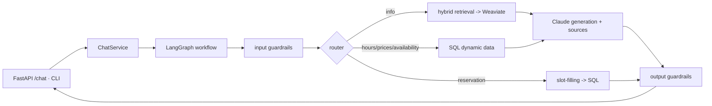

# AutoParkGPT

A production-grade, Retrieval-Augmented-Generation (RAG) parking-reservation chatbot
built with **LangChain**, **LangGraph**, **Weaviate**, and **Claude**. It answers
parking questions (general info, working hours, prices, availability, location) and
interactively collects reservation requests, behind a layered Clean Architecture with a
security guardrail pipeline.

> **Project status:** **All four stages complete** — RAG chatbot, human-in-the-loop
> administrator approval, an MCP server recording approved reservations, and a unified
> LangGraph orchestration that ties them together (with system/load testing). See
> [`TASKS.md`](TASKS.md). Full design rationale is in [`ARCHITECTURE.md`](ARCHITECTURE.md);
> evaluation methodology in [`EVALUATION.md`](EVALUATION.md).

---

## Highlights

- **Clean Architecture** — domain ports (`Protocol`) with infrastructure adapters; the
  domain has zero framework dependencies. Application logic is a **LangGraph** workflow.
- **Configurable LLM tier** — `claude-haiku-4-5` (default, economy) → `claude-sonnet-4-6`
  → `claude-opus-4-8`, swapped via one env var, no code change. The adapter is
  capability-aware (adaptive thinking is only sent to models that support it).
- **Local-first RAG** — local HuggingFace embeddings (no embeddings API key needed; note
  Claude has no embeddings API) and a single Weaviate container with hybrid (dense + BM25)
  search; Voyage AI is a drop-in production embedding option.
- **Security-first** — a guardrail pipeline blocks prompt injection / jailbreaks on input
  and screens output for system-prompt / internal / secret leakage; retrieval is
  restricted to `public` documents.
- **Fully typed & tested** — `mypy --strict`, `ruff`, **112 tests at 92% coverage**, CI on
  GitHub Actions (format, lint, type-check, tests, Docker build, security scans).

---

## Architecture at a glance



Layers: `domain/` (entities, value objects, ports) ← `application/` (use cases + graph) ←
`infrastructure/` (Claude, Weaviate, embeddings, SQL, guardrails) ← `interface/`
(FastAPI + CLI), wired at the `container.py` DI composition root.

---

## Setup

Requires Python 3.12+ and [uv](https://docs.astral.sh/uv/).

```bash
uv venv --python 3.12 .venv
uv pip install --python .venv ".[all,dev]"   # full app + dev tooling
cp .env.example .env                          # then set AUTOPARK_LLM__API_KEY
```

### Run the full stack (Docker Compose)

```bash
export AUTOPARK_LLM__API_KEY=sk-ant-...        # never commit this
docker compose up --build                      # weaviate :8080, postgres :5432, app :8000
```

### Initialise the knowledge base and database

```bash
# Apply DB migrations (Postgres/SQLite)
AUTOPARK_SQL__URL=... .venv/Scripts/python -m alembic upgrade head
# Ingest the static knowledge documents into Weaviate
.venv/Scripts/autoparkgpt ingest data/static
```

---

## Usage

### HTTP API

| Method | Path | Body / Result |
|---|---|---|
| `GET` | `/health` | `{status, name, environment}` |
| `POST` | `/chat` | `{session_id, message}` → `{message, intent, sources, reservation_id, blocked}` |

```bash
curl -s localhost:8000/chat -H 'content-type: application/json' \
  -d '{"session_id":"abc","message":"What are your opening hours?"}'
```

Conversation state (history + in-progress reservation) is keyed by `session_id`.

### Administrator approval (Stage 2)

When a reservation is created it enters `pending_approval` and an administrator is
notified. Admin endpoints are secured by `X-Admin-Token` (set `AUTOPARK_ADMIN__API_TOKEN`;
endpoints fail closed if it's unset). The decision flows back to the user — via a webhook
(`AUTOPARK_ADMIN__USER_WEBHOOK_URL`) and by asking the chatbot about the reservation
reference.

A web **admin console** is served at **http://127.0.0.1:8000/admin/ui** — enter the token,
view pending requests, and Approve / Reject (or type a natural-language decision) per row.
The same actions are available as REST endpoints:

| Method | Path | Purpose |
|---|---|---|
| `GET` | `/admin/reservations` | List pending reservations |
| `POST` | `/admin/reservations/{ref}/approve` | Approve |
| `POST` | `/admin/reservations/{ref}/reject` | Reject |
| `POST` | `/admin/reservations/{ref}/decision` | Approve/reject from a natural-language instruction (LLM admin agent) |

```bash
TOKEN=...   # AUTOPARK_ADMIN__API_TOKEN
curl -s localhost:8000/admin/reservations -H "X-Admin-Token: $TOKEN"
curl -s -X POST localhost:8000/admin/reservations/675e1e8a/approve -H "X-Admin-Token: $TOKEN"
# natural-language decision:
curl -s -X POST localhost:8000/admin/reservations/675e1e8a/decision \
  -H "X-Admin-Token: $TOKEN" -H 'content-type: application/json' \
  -d '{"instruction":"looks good, approve it"}'
```

Then the user can ask the chatbot: *"What's the status of reservation 675e1e8a?"* →
"…has been approved."

### MCP server — approved-reservation record (Stage 3)

On **approval**, the reservation is appended to a text file in the format
`Name | Car Number | Reservation Period | Approval Time`, exposed via a
[Model Context Protocol](https://modelcontextprotocol.io/) server with four tools:
`save_reservation`, `list_reservations`, `find_reservation`, `health_check`.

Run it over stdio:

```bash
autoparkgpt-mcp          # serves the records file at AUTOPARK_RECORDING__FILE_PATH
```

Register it with an MCP host (e.g. Claude Desktop `claude_desktop_config.json`):

```json
{
  "mcpServers": {
    "autoparkgpt-reservations": {
      "command": "autoparkgpt-mcp",
      "env": { "AUTOPARK_RECORDING__FILE_PATH": "data/reservations.txt" }
    }
  }
}
```

**Security:** the file path is server-configured (never client-supplied — no path
traversal); inputs are validated/normalized and the `|` separator is rejected in
free-text fields; `list`/`find` are read-only. Over HTTP, front it with auth.

### Unified orchestration (Stage 4)

The reservation lifecycle runs through one resumable **LangGraph orchestration**
(`validate → persist → notify-admin → human-approval [interrupt] → apply-decision →
mcp-communication → notify-user`). The chat reserve node *starts* it; the admin decision
*resumes* it. Set `AUTOPARK_RECORDING__BACKEND=mcp` to record through the MCP server
(real client→server) instead of writing the file directly. See
[`ARCHITECTURE.md`](ARCHITECTURE.md) §11.

System / load testing:

```bash
# with the server running + Weaviate up + admin token set
python scripts/loadtest.py    # chatbot, admin workflow, and MCP throughput/latency
```

### CLI

```bash
autoparkgpt version
autoparkgpt ingest data/static          # index knowledge base
autoparkgpt chat --session-id me        # interactive terminal chat
```

---

## Configuration

All settings come from the environment (or a local `.env`), prefixed `AUTOPARK_` with
`__` as the nesting delimiter — see [`.env.example`](.env.example). **Secrets are injected
via the environment only and never committed.**

| Variable | Default | Purpose |
|---|---|---|
| `AUTOPARK_LLM__MODEL` | `claude-haiku-4-5` | Claude tier (haiku/sonnet/opus) |
| `AUTOPARK_LLM__API_KEY` | — | Anthropic API key (required to run) |
| `AUTOPARK_EMBEDDING__PROVIDER` | `huggingface` | `huggingface` (local) or `voyage` |
| `AUTOPARK_VECTOR_STORE__HOST` | `localhost` | Weaviate host |
| `AUTOPARK_SQL__URL` | SQLite file | SQL DB connection string |
| `AUTOPARK_RETRIEVAL__TOP_K` | `4` | RAG retrieval depth |
| `AUTOPARK_RETRIEVAL__HYBRID_ALPHA` | `0.5` | dense vs keyword weighting |
| `AUTOPARK_ADMIN__API_TOKEN` | — | secures `/admin` endpoints (fail-closed if unset) |
| `AUTOPARK_ADMIN__ADMIN_WEBHOOK_URL` | — | optional: notify admin of new reservations |
| `AUTOPARK_ADMIN__USER_WEBHOOK_URL` | — | optional: notify user of the decision |
| `AUTOPARK_RECORDING__FILE_PATH` | `data/reservations.txt` | approved-reservation record file (MCP) |

LangSmith tracing uses the **standard** `LANGSMITH_*` names (not the `AUTOPARK_` prefix) so
a single `.env` configures both this app and `langgraph dev`:

| Variable | Default | Purpose |
|---|---|---|
| `LANGSMITH_TRACING` | `false` | turn tracing on/off (opt-in) |
| `LANGSMITH_API_KEY` | — | LangSmith key; tracing is a no-op without it |
| `LANGSMITH_PROJECT` | `autoparkgpt` | LangSmith project the runs land in |
| `LANGSMITH_ENDPOINT` | — | optional self-hosted/EU endpoint |

---

## Observability (LangSmith tracing)

Set `LANGSMITH_TRACING=true` and `LANGSMITH_API_KEY=...` in `.env`. On startup the app calls
`configure_tracing()`, which exports these into the process environment so the LangChain
runnables emit traces — runs (every node + Claude call) appear in your LangSmith project at
<https://smith.langchain.com>. It fails closed: with tracing off or no key, nothing is
exported and no data leaves the process; a value already set in the deployment environment
always wins over `.env`.

### LangGraph Studio

```bash
python scripts/enable_studio_pna.py            # one-time: see "PNA" note below
langgraph dev --no-reload --allow-blocking     # serves chat + orchestration on :2024
```

Open the printed Studio URL (`https://smith.langchain.com/studio/?baseUrl=http://127.0.0.1:2024`)
in **Chrome or Edge** (signed in to LangSmith) to visualize and step through both the `chat`
and `orchestration` graphs — including pausing at the human-approval `interrupt` and resuming
with `approve`/`reject`.

Three local-dev gotchas, all handled above:

- **`--allow-blocking`** — Studio re-invokes the graph factory per request; ours loads the
  HuggingFace embedding model, a synchronous (blocking) call the dev server rejects by
  default. The factory is also memoized (`studio.py`) so the model loads once, then is
  reused (first preview ~8s, instant after).
- **`--no-reload`** — `langgraph dev`'s own `.langgraph_api/` persistence writes inside the
  repo, which otherwise keeps the file-watcher reload-churning.
- **PNA / `enable_studio_pna.py`** — Chromium treats `smith.langchain.com → 127.0.0.1` as a
  Private Network Access request; Starlette's CORS rejects that preflight unless built with
  `allow_private_network=True`, which `langgraph-api` doesn't do and `langgraph.json` can't
  set. The script patches the installed package in your venv (idempotent; re-run after any
  `langgraph-api` upgrade). Without it, the browser shows "Failed to fetch" / "NetworkError".

---

## Development

```bash
.venv/Scripts/ruff format --check .          # formatting
.venv/Scripts/ruff check .                   # lint
.venv/Scripts/python -m mypy src eval        # strict type-check
.venv/Scripts/python -m pytest               # tests + coverage
```

(macOS/Linux: use `.venv/bin/...`.) Tests run fully offline — the LLM, vector store, and
embeddings are mocked via in-memory fakes (`tests/fakes.py`).

### Evaluation

```bash
docker compose up -d weaviate && autoparkgpt ingest data/static
python -m eval.run        # prints Recall@K, Precision@K, MRR, and latency
```

See [`EVALUATION.md`](EVALUATION.md) for methodology and metrics.

---

## Project structure

```
autoparkgpt/
├── src/autoparkgpt/
│   ├── domain/           # entities, value objects, ports (Protocols), exceptions
│   ├── application/      # prompts, extraction, LangGraph graph, ChatService, DTOs
│   ├── infrastructure/   # llm, embeddings, vectorstore, persistence, guardrails, config
│   ├── interface/        # api (FastAPI) + cli (Typer)
│   └── container.py      # DI composition root
├── alembic/              # SQL migrations
├── data/static/          # knowledge documents (ingested into Weaviate)
├── eval/                 # evaluation harness (metrics, dataset, runner)
├── tests/                # unit + integration tests
├── docker-compose.yml    # app + weaviate + postgres
└── Dockerfile
```

---

## CI/CD & infrastructure

- **CI/CD:** GitHub Actions ([`.github/workflows/ci.yml`](.github/workflows/ci.yml)) runs
  formatting, lint, strict type-checking, tests + coverage, a Docker build, and security
  scans (Trivy filesystem + gitleaks secret scanning). Recommended next steps before
  production: publish the image to a registry and gate merges on coverage thresholds.
- **Infrastructure as Code:** **Terraform is not justified yet** — Stage 1 runs entirely
  on Docker Compose with no cloud footprint to provision. Revisit after Stage 4 once a
  deployment target exists (managed Postgres + Weaviate + a container runtime). See
  [`ARCHITECTURE.md`](ARCHITECTURE.md) §8.

---

## License

Proprietary — internal project.
