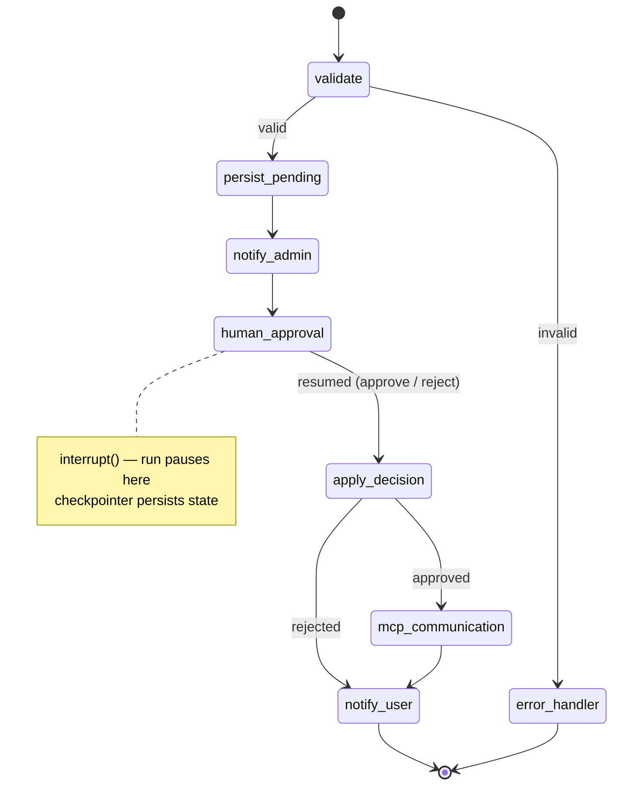
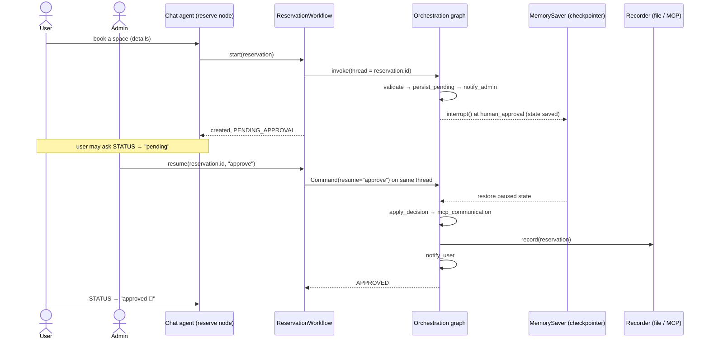
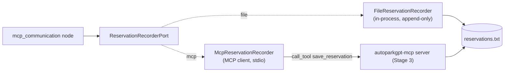
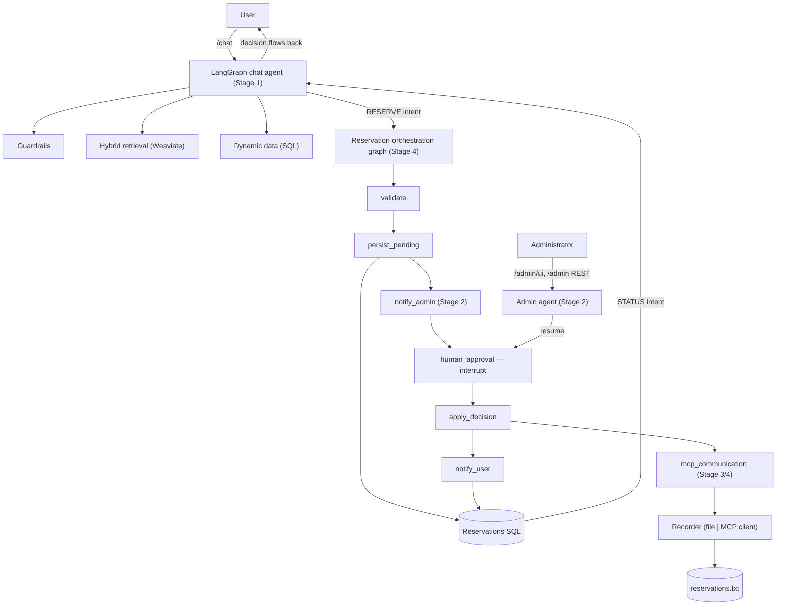
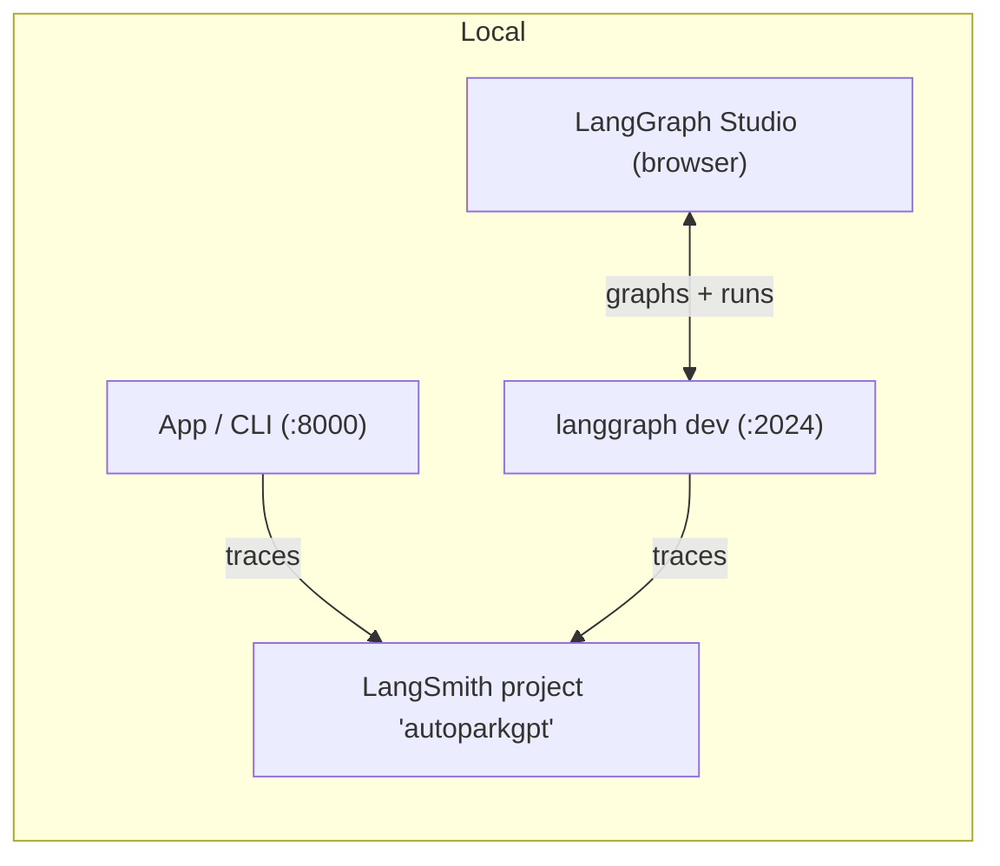

# AutoParkGPT — Stage 4: Unified LangGraph Orchestration

A walkthrough of what Stage 4 delivers: one resumable LangGraph that unifies the chatbot,
the human-in-the-loop approval, and the MCP recording — plus the observability
(LangSmith tracing + LangGraph Studio) and system/load testing that close out the project.

> Render tip: view in any Markdown previewer with Mermaid support (VS Code + a Mermaid
> extension, GitHub, etc.). Each `---` is a slide.

---

## 1. Goal

**Spec (Stage 4):** fold the components from Stages 1–3 into a **single orchestration**
built on **LangGraph**, with the administrator approval expressed as a real *pause* in the
graph, the approved reservation recorded through **MCP communication**, and the whole
system exercised with **system / load testing**.

Concretely: one graph that goes *validate → persist → notify admin → **pause for a human** →
apply decision → record via MCP → notify user*, resumable across separate HTTP requests.

---

## 2. What was delivered

- ✅ **Unified orchestration graph** (`application/graphs/orchestration.py`) — a resumable
  `StateGraph` with a typed `WorkflowState` and an `error_handler` branch.
- ✅ **Human-in-the-loop via `interrupt`** — the graph *pauses* at `human_approval`; a
  `MemorySaver` checkpointer persists the paused run so a later admin decision resumes the
  **same** run (`ReservationWorkflow.start()` / `resume()` / `is_pending()`).
- ✅ **Real MCP communication path** — the `mcp_communication` node records via the
  recorder port; `McpReservationRecorder` (an MCP **client**) is selectable with
  `AUTOPARK_RECORDING__BACKEND=mcp` and talks to the Stage 3 server over stdio.
- ✅ **Wired as the production path** — the chat *reserve* node calls `workflow.start()`;
  the admin decision calls `workflow.resume()` (both with a safe fallback so earlier-stage
  unit tests stay self-contained).
- ✅ **Observability** — opt-in **LangSmith tracing** for the app, CLI, and `langgraph dev`;
  both graphs exposed in **LangGraph Studio**.
- ✅ **System / load testing** (`scripts/loadtest.py`) — chatbot, admin workflow, and MCP
  measured for latency, throughput, and reliability.
- ✅ **Quality** — 177 tests at 93% coverage; `ruff` + `mypy --strict` clean; verified
  end-to-end against the live stack (real Claude + Weaviate + SQLite + MCP).

---

## 3. The unified orchestration graph



- **`validate`** — domain rules (period in the future, within `max_reservation_days`, valid
  car number). On failure it routes straight to `error_handler` — nothing is persisted and
  the admin is never notified.
- **`persist_pending`** → status `PENDING_APPROVAL` in the SQL repo.
- **`notify_admin`** → `AdminNotifierPort` (log or webhook).
- **`human_approval`** → **`interrupt()`**: the run halts and the process is free to return.
- **`apply_decision`** → `APPROVED` / `REJECTED` transition.
- **`mcp_communication`** (approved only) → record via the recorder port (file or MCP).
- **`notify_user`** → `UserNotifierPort`; the decision is now queryable via the chat
  `STATUS` intent.

---

## 4. Human-in-the-loop: pause and resume across requests

The key Stage 4 idea: approval is not a blocking call — it is a **durable pause**. The graph
runs to `human_approval`, `interrupt()` suspends it, and the checkpointer saves the state
under a thread id (the reservation id). A completely separate request — the admin's decision
— resumes that thread with `Command(resume=decision)`.



`is_pending(reservation_id)` inspects the checkpoint's `next` to tell whether a run is
paused — used to guard `resume()` (resuming a non-existent thread raises `ReservationError`
rather than silently starting a fresh run).

---

## 5. Technical internals

**Typed shared state** (`WorkflowState`, a `TypedDict`) threads the reservation and the
outcome through the nodes:

```python
class WorkflowState(TypedDict, total=False):
    reservation: Reservation
    decision: str            # "approve" | "reject" (set on resume)
    status: ReservationStatus
    error: str               # set by validate → routes to error_handler
```

**Dependency injection** — nodes are grouped in an `OrchestrationNodes` dataclass holding
the repo, notifiers, recorder, and limits; `build_orchestration_graph(nodes, checkpointer)`
wires the `StateGraph`. The composition root (`container.py`) builds it via
`build_reservation_workflow(...)` and injects it into both the chat service and the admin
approval service — so the graph is the single source of truth for the lifecycle.

**Decision routing** is explicit: `approved = state.get("decision") == "approve"`; a
conditional edge sends approved runs through `mcp_communication` and rejected runs straight
to `notify_user`.

---

## 6. MCP communication node (file vs. MCP backend)

The recorder is a **port**; the `mcp_communication` node depends only on it. Two adapters
are selectable by config, so "MCP communication" is a real, swappable path — not a mock:



- `AUTOPARK_RECORDING__BACKEND=file` (default) — reliable, synchronous, in-process.
- `AUTOPARK_RECORDING__BACKEND=mcp` — spawns `autoparkgpt-mcp` and calls its
  `save_reservation` tool over stdio; this is the genuine client → server → file path and
  is tested against an in-memory server session.

---

## 7. Whole-system integration (Stages 1–4)



- **Stage 1** answers questions and collects reservations (RAG + slot-filling + guardrails).
- **Stage 2** routes each reservation to the admin and returns the decision to the user.
- **Stage 3** records approved reservations and exposes them via an MCP server.
- **Stage 4** unifies all of it into one resumable graph and adds the real MCP-client path.

---

## 8. Observability — LangSmith tracing & LangGraph Studio

**Tracing (opt-in).** `ObservabilitySettings` reads the *standard* `LANGSMITH_*` variables
(so one `.env` drives the app and `langgraph dev`); `configure_tracing()` exports them into
`os.environ` at startup — pydantic loads `.env` but doesn't export it, which is why the app
would otherwise never trace. It **fails closed**: with tracing off or no key, nothing leaves
the process.

**Studio.** `langgraph.json` exposes both graphs (`chat`, `orchestration`) for
`langgraph dev`, so you can visualize and step through them — including pausing at the
approval `interrupt` and resuming with `approve`/`reject`.



Three local-dev gotchas (documented in the README), all real defects worked around:

- **PNA / CORS** — Chromium sends a Private Network Access preflight for
  `smith.langchain.com → 127.0.0.1`; Starlette's CORS rejects it unless built with
  `allow_private_network=True`, which `langgraph-api` doesn't and `langgraph.json` can't set.
  `scripts/enable_studio_pna.py` patches it idempotently.
- **`--allow-blocking`** — Studio re-invokes the graph factory per request; ours loads the
  HuggingFace embedding model (a blocking call the dev server rejects). The factories are
  memoized so the model loads once.
- **`--no-reload`** — `langgraph dev`'s own `.langgraph_api/` writes otherwise churn the
  file-watcher.

---

## 9. System / load testing

`scripts/loadtest.py` exercises the three surfaces against the live stack. Representative
local results (single machine; Claude Haiku 4.5, local embeddings, SQLite, Weaviate):

| Surface | Metric | Result |
|---|---|---|
| Chatbot `/chat` (LLM-bound) | latency mean / p95 | ~4.9 s / ~9 s |
| Admin approve (resume workflow) | latency | ~29 ms |
| MCP `save_reservation` | throughput | ~171 saves/s |

- The chatbot is **LLM-latency bound** — cost/quality is a deployment knob (`AUTOPARK_LLM__MODEL`).
- The approval resume is a cheap state transition; the human is the only slow part.
- MCP recording is fast and durable (append-only + `fsync`).

---

## 10. Security & reliability

- **Fail-safe validation** — invalid reservations never persist and never notify the admin.
- **Durable pause** — the checkpointer means an in-flight approval survives across requests;
  resuming a non-pending run is rejected rather than silently restarting.
- **MCP hardening (from Stage 3)** — server-controlled path, input validation, `|`-injection
  rejected, read-only list/find, stdio transport (HTTP must sit behind auth).
- **Secrets** — only via the environment; tracing is opt-in and off by default.
- **Notifications are best-effort** — a webhook failure never rolls back an approval.

---

## 11. Decisions & what's next

- **Decision:** the orchestration graph is the real production path, but chat/admin services
  accept an **optional** workflow with a safe direct-repo fallback — this made the graph the
  source of truth without regressing self-contained Stage 1/2 unit tests.
- **Decision:** `interrupt()` + a checkpointer (over a blocking approval call) makes the
  human step first-class and resumable — the correct LangGraph idiom for HITL.
- **Decision:** MCP as an explicit node with a swappable recorder keeps "MCP communication"
  honest (a real client call) while defaulting to the reliable in-process writer.
- **Infrastructure:** with the app, Weaviate, PostgreSQL, and the MCP process, **Terraform is
  now recommended** for deployment, plus the LangGraph **Postgres checkpointer** so paused
  runs survive across workers. Docker Compose remains sufficient for local/demo.

---

## 12. Try it

```bash
# 1. Run the app (chat + admin UI), tracing optional via .env
uvicorn autoparkgpt.interface.api.main:app --port 8000

# 2. Book in the chat UI (http://127.0.0.1:8000/) → PENDING_APPROVAL
# 3. Approve in the admin console (http://127.0.0.1:8000/admin/ui) → the SAME workflow run
#    resumes, records via MCP, and notifies the user
# 4. Ask STATUS in chat → "approved"; the line appears in data/reservations.txt

# Visualize the graphs in LangGraph Studio (Chrome/Edge):
python scripts/enable_studio_pna.py
langgraph dev --no-reload --allow-blocking
# open https://smith.langchain.com/studio/?baseUrl=http://127.0.0.1:2024

# Use the real MCP-client recording path:
#   AUTOPARK_RECORDING__BACKEND=mcp
```
